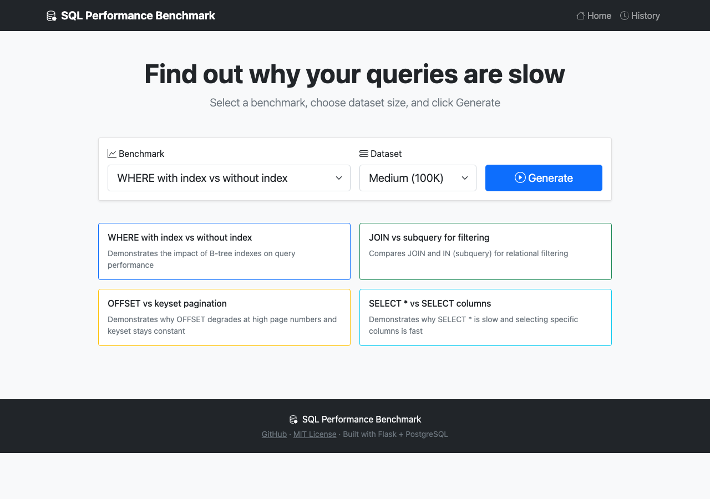
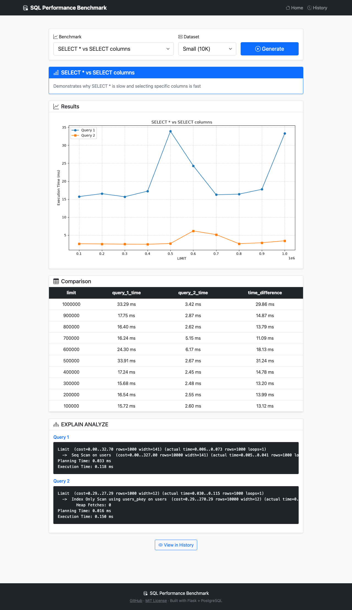
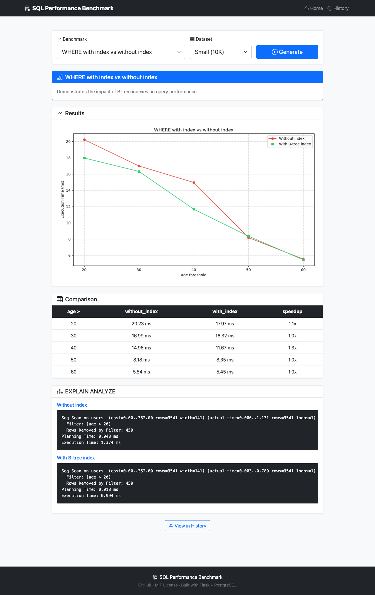
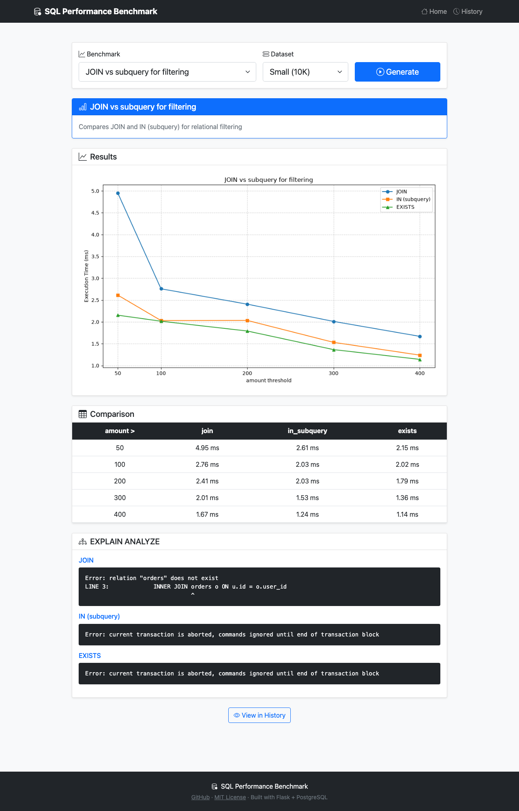
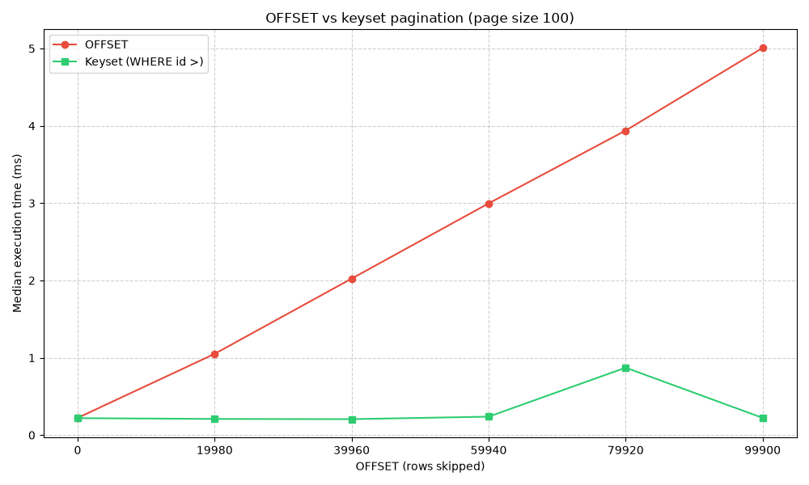
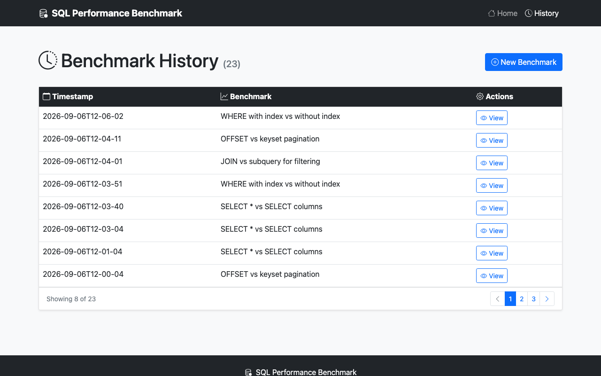

<h1 align="center">🔍 SQL Performance Benchmark</h1>

<p align="center">
  <strong>Measure SQL performance patterns on PostgreSQL — with honest numbers and real EXPLAIN ANALYZE output</strong>
</p>

<p align="center">
  <a href="https://python.org"></a>
  <a href="LICENSE"></a>
  <a href="Dockerfile"></a>
  <a href="../../actions/workflows/ci.yml"></a>
</p>

---

## What is this?

A toolkit for **measuring common SQL performance patterns** against a real PostgreSQL database.

Every query has a cost. Some are obvious (`SELECT *` on a wide table), some are subtle (`OFFSET`
pagination that degrades with page depth), and some depend entirely on context (`JOIN` vs `subquery`
vs `EXISTS`). This tool runs the queries, times them, and shows the query plan behind each result.

<p align="center">
  
  <br>
  <em>Choose a benchmark and a dataset size, then click Generate</em>
</p>

---

## What you'll learn

Every benchmark ends with a conclusion the tool derives from the run it just did — never a
hand-written blurb, so it cannot drift away from the numbers above it. The point of each one is to
show **where the cost is actually paid**, because that is what decides the fix:

| Benchmark | The lesson | Who pays |
|---|---|---|
| **SELECT \* vs columns** | You are not straining the database, you are straining your serializer. Fetching 16 columns instead of 3 costs ~5x end to end while PostgreSQL's own time barely moves — the bill is decoding rows into objects and, in a real service, re-serializing them to JSON. | **The client** — your API process and the frontend waiting on it |
| **Index usage** | An index speeds up *finding* rows, never *sending* them. The same index is worth ~8x to PostgreSQL but only ~2x to the caller, because `SELECT *` ships the same wide rows either way. | **The result set** |
| **OFFSET vs keyset** | This one really *is* the database's problem. `OFFSET 100000` makes PostgreSQL walk and discard 100,000 rows to return 100. No client tuning helps; only changing the query does. | **PostgreSQL** |
| **JOIN vs IN vs EXISTS** | They do not answer the same question. `JOIN` emits one row per child, `IN`/`EXISTS` one row per parent — 2.4x more data for the same users. Choose by the shape you need, not by a stopwatch. | **The result set** |

Read together they make one point: *"the query is slow"* is not a diagnosis. The same symptom has a
different cure depending on whether the time is going to the planner, the wire, or your driver.

---

## How the measurements work

The numbers are only worth something if the method is. This is what the tool does on every data point:

| | Why |
|---|---|
| **Two timings per data point** | **total** is the wall clock an application feels — planning, execution, transfer and the driver building Python objects. **server** is PostgreSQL's own `Execution Time` from `EXPLAIN (ANALYZE, TIMING OFF)`. The gap between them is the client. |
| **One discarded warm-up run** | Without it, whichever query runs first pays for the cold cache. That alone was enough to make the "slow" query look slow. |
| **Median of 5 timed runs** | A single sample is dominated by scheduler noise. The median ignores the outlier that a mean would carry. |
| **Data points derived from the real row count** | A `LIMIT` above the table size returns the whole table every time, which flattens the curve into a straight line of noise. |
| **Row counts shown in every table** | So you can see the query actually returned something. A benchmark over an empty result set measures nothing. |

### Why both timings matter

Reporting only the wall clock is how a client-side cost gets presented as a database result. On this
dataset, `SELECT * LIMIT 10000` takes **17.22 ms total but 0.31 ms inside PostgreSQL** — 98% of what
you would be "measuring" is psycopg2 turning bytes into tuples.

It cuts the other way too. Adding a B-tree index to `WHERE age = 35` improves the wall clock by only
**2.1x**, because fetching and shipping the matching rows swamps the lookup. PostgreSQL's own time
improves by **7.7x**. Judge the index on the second number; budget your endpoint with the first.

In the charts, **solid lines are the total and dashed lines are PostgreSQL alone**.

### What this is not

These are **timings on a synthetic dataset in a container**, not a claim about your production
database. Row counts, hardware, PostgreSQL version, `work_mem`, concurrency and data distribution all
move these numbers. Use the tool to see *why* a plan changes — read the `EXPLAIN ANALYZE` output, not
just the chart.

---

## Benchmarks

### 📊 SELECT * vs SELECT columns

```sql
SELECT * FROM users LIMIT %s;
SELECT id, name, email FROM users LIMIT %s;
```

The `users` table has 16 columns. `EXPLAIN` puts the full row at **143 bytes** against **30 bytes**
for the three-column projection — a 4.8x difference in what has to be shipped, and the measured
total-time gap lands at ~5x, right where the widths predict.

The interesting part is where that time goes. **PostgreSQL is marginally *faster* for `SELECT *`**
(0.31 ms vs 0.46 ms at 10k rows): returning the stored tuple needs no projection work, while picking
three columns means building a new one. The entire penalty is on the client — 98% of the wall clock
is psycopg2 decoding 16 columns instead of 3.

So `SELECT *` is worth avoiding, but not for the reason it is usually given. It is not straining the
planner; it is straining your application and your network. The LIMITs sweep from 10% to 100% of the
table, so the curve reflects a growing result set rather than the same query run ten times.

<p align="center">
  
</p>

### ⚡ Index usage

```sql
SELECT * FROM users WHERE age = %s;   -- before CREATE INDEX
SELECT * FROM users WHERE age = %s;   -- after  CREATE INDEX
```

Same query, twice: once with no index on `age`, then again after `CREATE INDEX`. **The "no index"
plan is captured before the index exists** — otherwise both `EXPLAIN` runs report the same indexed
plan and the label lies about what you are looking at.

This is the clearest case for reading both lines. At 100k rows the index is worth **7.7x** to
PostgreSQL (5.25 ms → 0.68 ms) but only **2.1x** on the wall clock (8.16 ms → 3.83 ms), because
`SELECT *` ships ~1,600 wide rows either way and that transfer cost is indifferent to how they were
found. An index speeds up *finding* rows, not *sending* them.

On a small dataset PostgreSQL may legitimately still choose a sequential scan: reading 10,000 rows is
cheaper than an index lookup plus heap fetches. That is the planner being right, not the benchmark
being broken — pick a larger dataset size to see the crossover.

<p align="center">
  
</p>

### 🔗 JOIN vs subquery vs EXISTS

```sql
SELECT u.id, u.name, u.email, o.amount
FROM users u INNER JOIN sqlperf_orders o ON u.id = o.user_id
WHERE o.amount > %s;

SELECT id, name, email FROM users
WHERE id IN (SELECT user_id FROM sqlperf_orders WHERE amount > %s);

SELECT id, name, email FROM users u
WHERE EXISTS (SELECT 1 FROM sqlperf_orders o WHERE o.user_id = u.id AND o.amount > %s);
```

**These three do not return the same thing.** Each user has up to 5 orders, so `JOIN` emits one row
per matching *order* while `IN` and `EXISTS` emit one row per matching *user*: at `amount > 50` that
is **225,245 rows against 95,077**. Comparing their times without noticing that is comparing two
different questions.

Which is exactly what makes it interesting. `JOIN` is the fastest of the three inside PostgreSQL
(40.8 ms vs 47.1 and 55.8) and the slowest overall (160.6 ms vs 83.4 and 78.3), because it ships 2.4x
more rows. `IN` and `EXISTS` usually collapse to the same `Hash Semi Join` — the `EXPLAIN` output
shows it directly.

> An earlier version of this benchmark gave every user at most one order. With 1:1 data there is no
> fan-out, all three return identical row sets, and the planner produces byte-identical plans — it
> compared three spellings of the same query.

<p align="center">
  
</p>

### 📄 OFFSET vs keyset pagination

```sql
SELECT * FROM users ORDER BY id LIMIT 100 OFFSET %s;      -- scans and discards
SELECT * FROM users WHERE id > %s ORDER BY id LIMIT 100;  -- jumps straight there
```

The page size is held at 100 and **the offset is what varies**, from the first page to the deepest
one the dataset allows. That is the whole point: `OFFSET` has to walk and throw away every skipped
row, so its cost grows with page *depth*, while keyset pagination stays flat.

This is the one benchmark where the server number is the dramatic one, because both queries return
the same 100 rows and the transfer cost cancels out. At page 400, PostgreSQL spends 1.80 ms on
`OFFSET` and 0.01 ms on keyset — **150x** — while the wall clock only shows 4x.

<p align="center">
  
</p>

### 📜 Historical results

Every run is saved with a timestamp under `results/` and browsable at `/history`.

<p align="center">
  
</p>

---

## Quick start

```bash
git clone https://github.com/jonaas-dev/sql-performance.git
cd sql-performance
cp .env.example .env
docker compose up --build
```

Open **http://localhost:8000**.

Compose brings up PostgreSQL, seeds it to `DB_SEED_SIZE`, and only then starts the app. The database
and the app are both bound to `127.0.0.1`, so nothing is exposed outside your machine.

### Dataset sizes

| Size | Rows | Seed time |
|------|------|-----------|
| `small` | 10,000 | ~1s |
| `medium` | 100,000 | ~2s |
| `large` | 1,000,000 | ~15s |

Set the initial size with `DB_SEED_SIZE` in `.env`. **Changing the size in the web UI reseeds the
`users` table** — it truncates and regenerates the data so the selector reflects reality rather than
being a label on an unchanged dataset.

> ⚠️ **The tool writes to the database it connects to.** It truncates `users` when reseeding, and
> creates and drops `sqlperf_orders` and `sqlperf_idx_users_age` around the relevant benchmarks.
> Point it at a throwaway database, never at one with data you care about.

---

## Architecture

```
sql-performance/
├── app/
│   ├── __init__.py          # Flask app factory
│   ├── config.py            # Configuration from environment
│   ├── db.py                # PostgreSQL connection
│   ├── benchmark.py         # Benchmark runner + EXPLAIN ANALYZE
│   ├── history.py           # Historical results storage (filesystem)
│   ├── routes.py            # Flask routes
│   └── templates/           # Jinja2 templates
├── benchmarks/
│   ├── base.py              # BenchmarkBase ABC + the shared measure() helper
│   ├── registry.py          # Auto-discovery — drop a file, it's registered
│   ├── select_star.py       # SELECT * vs columns
│   ├── index_usage.py       # B-tree index impact
│   ├── join_vs_subquery.py  # JOIN vs IN vs EXISTS
│   └── pagination.py        # OFFSET vs keyset
├── sql/
│   ├── init.sql             # Schema only
│   └── seed.py              # Parametrized seeder (small/medium/large)
├── tests/                   # pytest — unit + PostgreSQL integration
├── wsgi.py                  # Gunicorn entry point
├── docker-compose.yml       # PostgreSQL + seeder + app
└── Dockerfile
```

---

## Adding your own benchmark

Drop a `.py` file in `benchmarks/`. The registry discovers it on import — no registration code.

```python
import io

import matplotlib
matplotlib.use("Agg")
import pandas as pd
from matplotlib.backends.backend_agg import FigureCanvasAgg
from matplotlib.figure import Figure

from benchmarks.base import (
    BenchmarkBase, BenchmarkResult, QueryResult, format_ms, measure, table_row_count,
)
from benchmarks.registry import register

QUERY = "SELECT * FROM users WHERE city = %s"


@register
class CityFilterBenchmark(BenchmarkBase):
    name = "city_filter"
    title = "Filtering by city with and without an index"
    description = "Compare a seq scan against a B-tree index on a low-cardinality column"
    required_tables = ["users"]

    def setup(self, conn) -> None:
        self.check_requirements(conn)   # fails loudly if `users` is missing

    def run(self, conn) -> BenchmarkResult:
        # Cities that actually exist in the seed data.
        cities = ["New York", "Los Angeles", "Chicago", "Houston", "Phoenix"]

        with conn.cursor() as cur:
            # measure() does the warm-up, the median and the server timing.
            results = [measure(cur, QUERY, (city,)) for city in cities]

        query = QueryResult(
            name="Filter by city",
            query=QUERY,
            limits=cities,          # x-axis values
            times=[m.wall_ms for m in results],
            rows_fetched=[m.rows_fetched for m in results],
            server_times=[m.server_ms for m in results],
        )

        comparison = pd.DataFrame({
            "city": cities,
            "rows": query.rows_fetched,
            "total": [format_ms(m.wall_ms) for m in results],
            "server": [format_ms(m.server_ms) for m in results],
        })

        fig = Figure(figsize=(8, 5))
        canvas = FigureCanvasAgg(fig)
        ax = fig.add_subplot(111)
        ax.plot(cities, times, marker="o")
        ax.set_xlabel("City")
        ax.set_ylabel("Median execution time (ms)")
        ax.grid(True, alpha=0.3)
        fig.tight_layout()

        buf = io.BytesIO()
        canvas.print_png(buf)
        buf.seek(0)

        return BenchmarkResult(
            name=self.name, title=self.title, description=self.description,
            queries=[query], comparison_table=comparison, plot_buffer=buf,
        )

    def teardown(self, conn) -> None:
        """Drop anything setup() created. Prefix objects with `sqlperf_`."""
```

### The contract

| Method | Purpose |
|--------|---------|
| `setup(conn)` | Prepare the database. Call `self.check_requirements(conn)` first. |
| `run(conn)` | Execute queries with `measure()`, return a `BenchmarkResult`. |
| `teardown(conn)` | Drop anything `setup()` created. Optional. |

| Attribute | Type | Purpose |
|-----------|------|---------|
| `name` | `str` | Unique id, used in the URL: `?benchmark=name` |
| `title` | `str` | Shown in the UI |
| `description` | `str` | What this benchmark tests |
| `required_tables` | `list[str]` | Enforced by `check_requirements()` |

`BenchmarkResult` carries `queries` (a list of `QueryResult`), a `comparison_table` DataFrame, a
`plot_buffer` PNG, a `takeaway`, and optionally `explain_plans`. When `explain_plans` is empty the runner collects
them automatically — supply them yourself when the plan must be captured at a specific moment, as
`index_usage` does.

**End with a conclusion.** Set `takeaway=` on your `BenchmarkResult`: a `Takeaway` carries a
`verdict`, a `CostCentre` (`DATABASE`, `CLIENT` or `TRANSFER`), the `points` of evidence behind it
and the `advice` that follows. Build every number in it from the measurements you just took — a
takeaway that repeats a number the chart does not show is how a benchmark starts lying. It refuses
to be constructed without evidence, on purpose.

**Helpers worth using:** `measure(cursor, query, params)` returns a `Measurement` with
`rows_fetched`, `wall_ms`, `server_ms` and a `client_share` property, doing the warm-up, the median
and the `EXPLAIN` for you. `table_row_count(conn)` lets you size your data points to the dataset
instead of hardcoding them, `format_ms` and `speedup` keep table columns consistent, and
`plot_server_series(ax, query, color)` adds the dashed server line to a chart. Raise
`BenchmarkNotApplicable` when the dataset is too small for your benchmark to mean anything.

**Report both timings.** A table with only wall-clock numbers cannot distinguish a query PostgreSQL
struggles with from one that merely returns a lot of data.

---

## Configuration

| Variable | Default | Description |
|----------|---------|-------------|
| `DB_HOST` | `localhost` | PostgreSQL host |
| `DB_PORT` | `5432` | PostgreSQL port |
| `DB_USER` | `user` | Database user |
| `DB_PASSWORD` | `password` | Database password |
| `DB_NAME` | `test_db` | Database name |
| `DB_SEED_SIZE` | `medium` | Initial dataset size (`small`/`medium`/`large`) |
| `LOG_LEVEL` | `INFO` | Python logging level |

---

## Endpoints

| Route | Description |
|-------|-------------|
| `GET /` | Landing page with benchmark selector |
| `GET /generate?benchmark=<name>&size=<size>` | Reseed if needed, then run a benchmark |
| `GET /history` | List historical runs (paginated) |
| `GET /results/<id>` | View a stored result |

---

## Development

```bash
python -m venv .venv
source .venv/bin/activate
pip install -r requirements.txt -r requirements-dev.txt

ruff check .
pytest --cov
```

The suite is split in two:

- **Unit tests** run anywhere with no database.
- **Integration tests** (`tests/test_integration.py`) need PostgreSQL and are skipped when none is
  reachable. They are the ones that guard the measurement contract — that every benchmark fetches
  rows, that data points stay inside the dataset, and that the two index plans actually differ.

Point them at a database with `TEST_DB_HOST`, `TEST_DB_PORT`, `TEST_DB_USER`, `TEST_DB_PASSWORD` and
`TEST_DB_NAME`. CI always provides one, so the integration gates never silently skip there.

---

## License

[MIT](LICENSE) — use it, fork it, learn from it.
