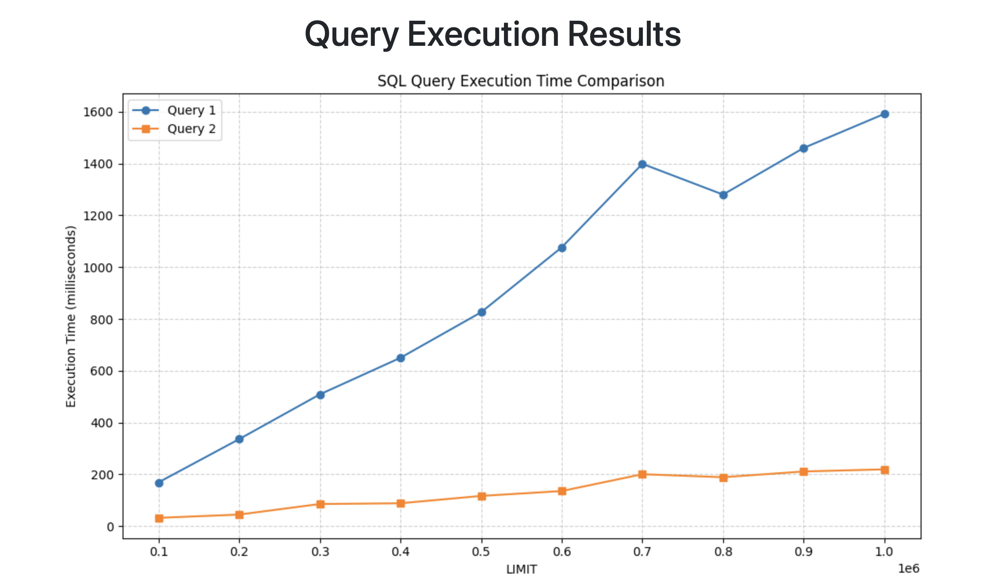
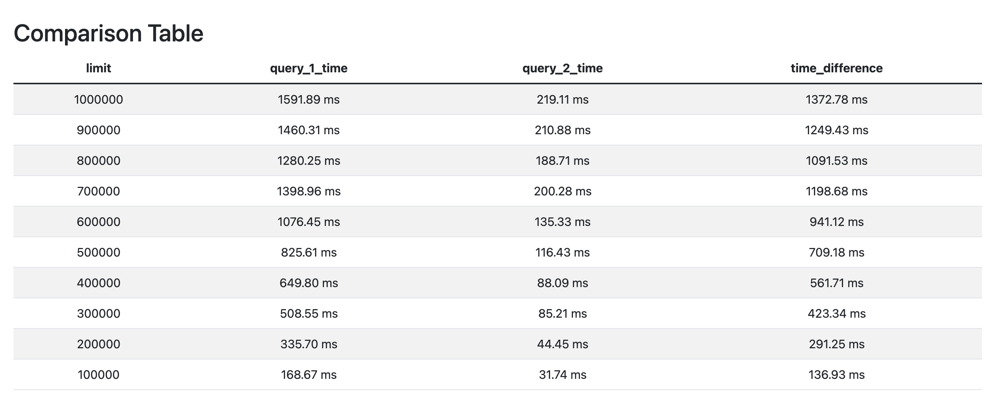

# SQL Performance Analysis Tool

This project is a **Flask-based web application** designed to compare the performance of two SQL queries by analyzing their execution times with varying `LIMIT` parameters. The tool allows users to visualize query performance, generate comparison tables, and save results to CSV files for further analysis.

## Features

- Executes two SQL queries repeatedly with different `LIMIT` values.
- Measures and compares execution times for each query.
- Generates a detailed comparison table, including time differences.
- Visualizes performance data with plots using Matplotlib.
- Exports query results and execution data to CSV files.

## 🧑‍🏭 How It Works

1. SQL queries are stored in separate files (e.g., `query_1.sql` and `query_2.sql`).
2. The application connects to a PostgreSQL database and executes the queries.
3. Execution times are measured for each query and `LIMIT` combination.
4. Results are displayed as:
   - A comparison table in the browser.
   - A plot showing execution time trends.
5. Users can analyze the output directly in the browser or download the CSV files.

## 📓 Requirements

- Python 3.8 or higher
- PostgreSQL database
- Required Python packages (listed in `requirements.txt`)

## 🚀 Installation

1. Clone this repository:
   ```bash
   git clone https://github.com/yourusername/sql-performance-tool.git
   cd sql-performance-tool
   ```
2. Install dependencies:
   ```bash
   docker-compose up
   ```
4. Place your SQL queries in the `queries/` directory (e.g., `query_1.sql` and `query_2.sql`).

## Usage

1. Open a web browser and navigate to `http://0.0.0.0:8000/generate`.

## Output

- **Comparison Table**: Displays execution times and differences.
- **Performance Plot**: Visualizes execution times for both queries.
- **CSV Files**: Saves execution data for further offline analysis.

## Example

Query execution results:



Comparation table:




## How to Interact with the Database

To interact with the PostgreSQL database and explore the data, you can use the following commands as a guide:

```bash
# Access the PostgreSQL database container
docker exec -it postgres-db psql -U user -d test_db

# List all tables in the database
test_db=# \dt
#        List of relations
#  Schema | Name  | Type  | Owner
# --------+-------+-------+-------
#  public | users | table | user
# (1 row)

# Query data from the "users" table
test_db=# SELECT * FROM users;
#  id |    name    |         email
# ----+------------+------------------------
#   1 | John Doe   | john.doe@example.com
#   2 | Jane Smith | jane.smith@example.com
# (2 rows)

# Analyze the performance of a query
test_db=# EXPLAIN ANALYZE SELECT * FROM users;

#  Seq Scan on users  (cost=0.00..11.70 rows=170 width=440) (actual time=0.018..0.020 rows=2 loops=1)
#  Planning Time: 0.067 ms
#  Execution Time: 0.049 ms
# (3 rows)
```

## License

This project is licensed under the MIT License. See `LICENSE` for details.

## Contributing

Contributions are welcome! Feel free to open issues or submit pull requests.
